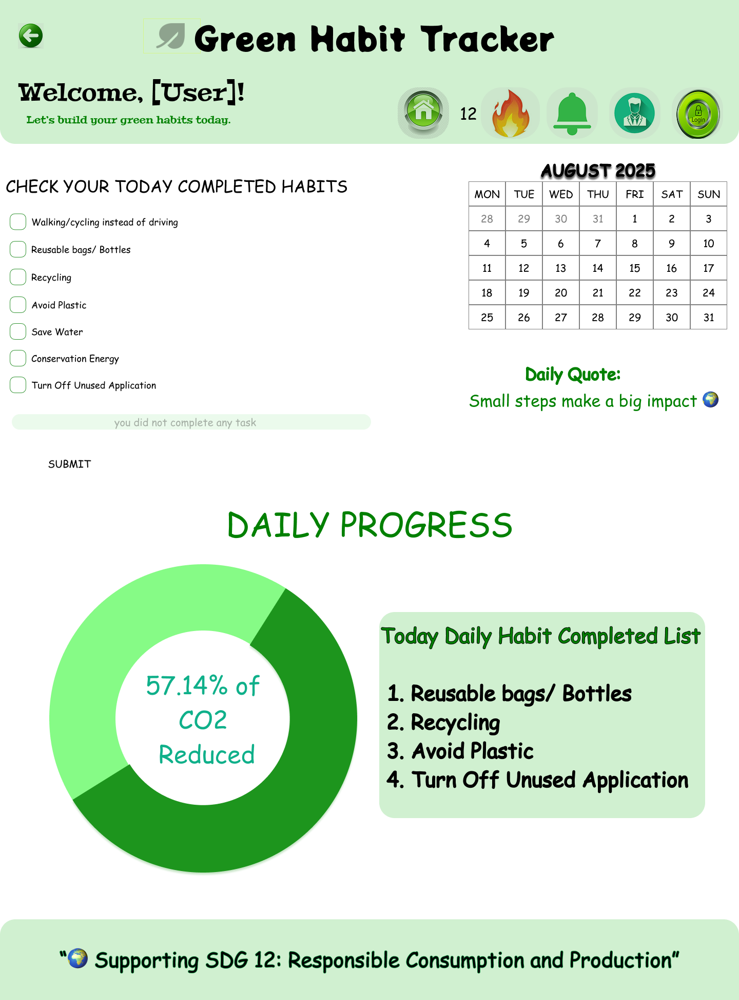
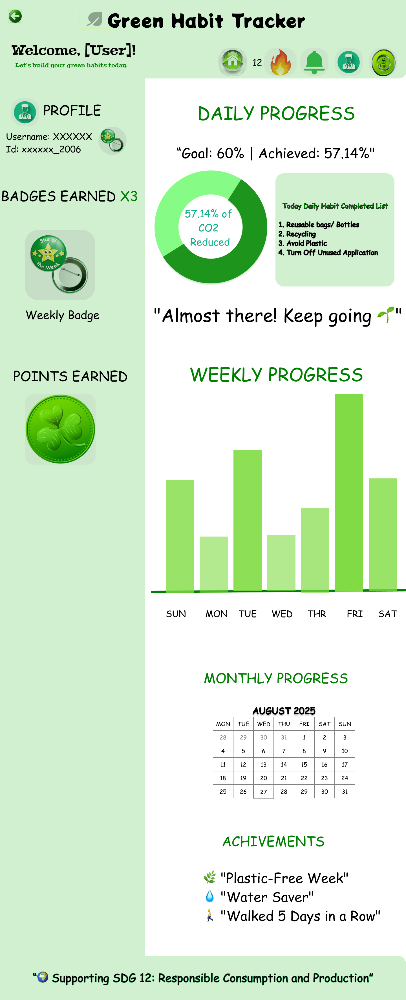
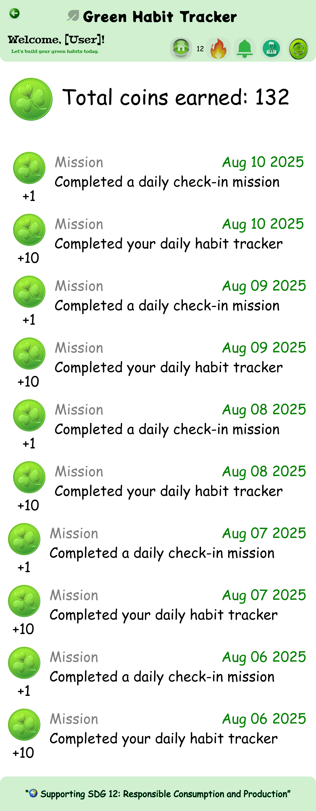
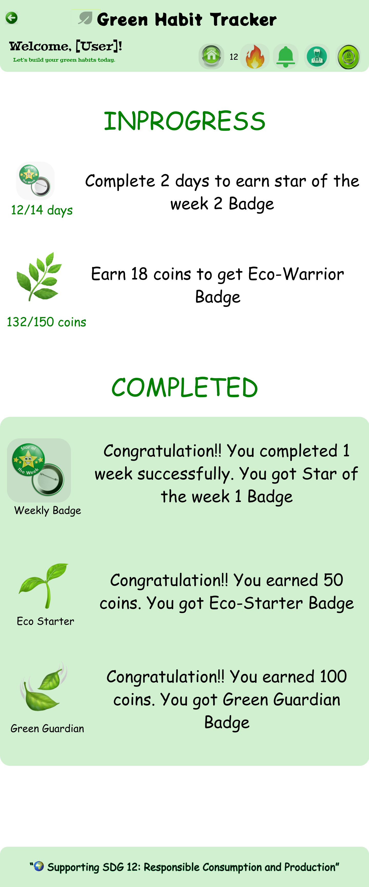

# green-habit-tracker-ui
# Green Habit Tracker – UI/UX Design (Figma)

## 📌 Overview
A mobile app UI/UX design prototype focused on encouraging sustainable lifestyle habits through gamified daily tracking.

## 🎯 Objective
To design an intuitive and engaging mobile experience that motivates users to build eco-friendly habits.

## Demo Video - Green Habit Tracker
https://drive.google.com/file/d/1uWYbyr-nf_O-63KQQ7trowR1jo1zP5M2/view?usp=sharing

## 🛠 Tools Used
- Figma
- UI/UX Design
- Interactive Prototyping
- Design Systems

## 🖼 Screenshots

## 📈 Key Features
- Streaks and progress visualization
- User-centered navigation
- Eco-friendly visual design
